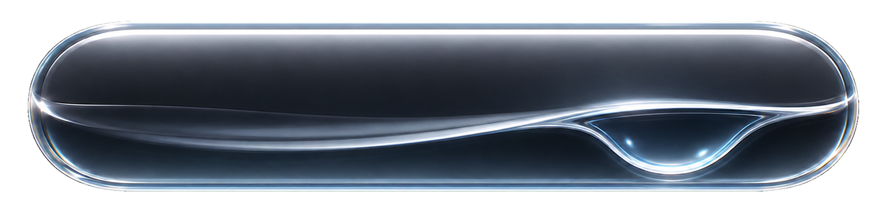
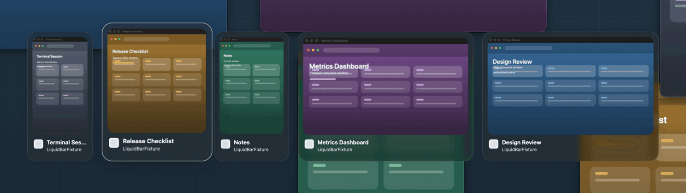
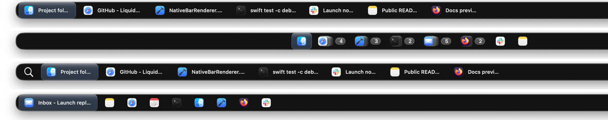
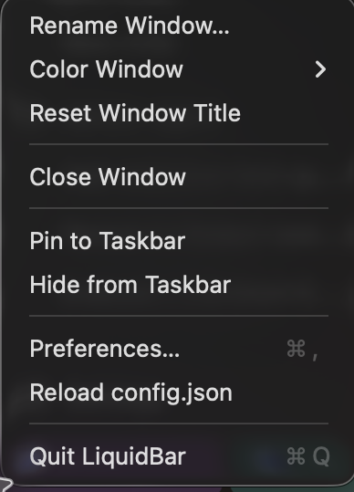
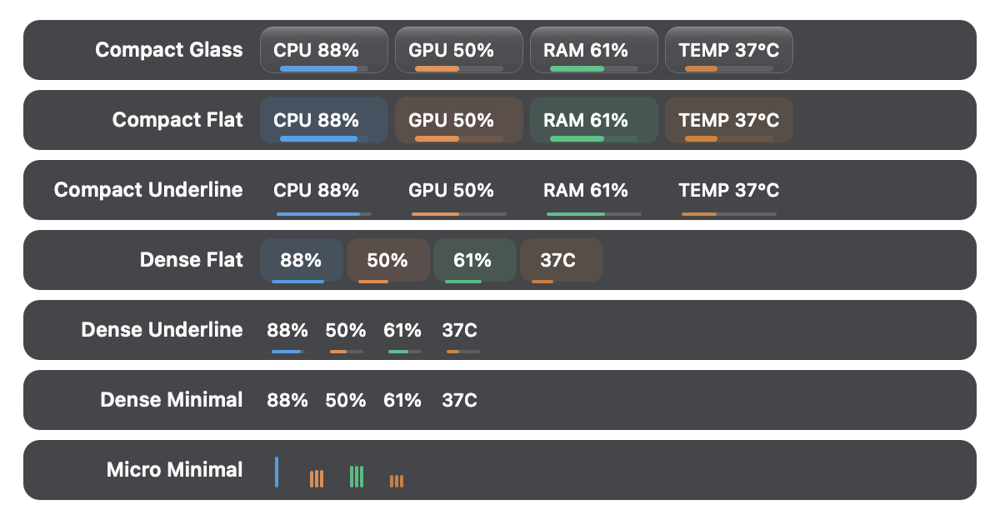
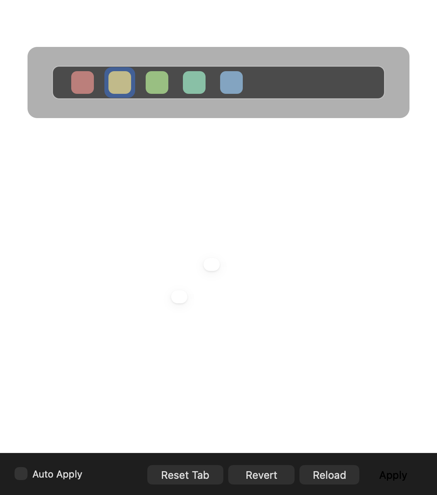

# LiquidBar

[English](README.md)



**macOS용 오픈 소스 Liquid Glass 작업 표시줄 및 Cmd-Tab 윈도우 전환기입니다.**

LiquidBar는 Mac 고급 사용자가 늘 아쉬워하던 윈도우 제어 경험을 제공합니다.
제대로 된 작업 표시줄, 큰 윈도우 썸네일, Windows Alt-Tab에 가까운 전환 동작,
시스템 표시기, 세밀한 설정을 macOS의 기본 사용 흐름을 해치지 않고 자연스럽게
더합니다.

## 처음부터 열린 설계

많은 macOS 작업 표시줄 유틸리티는 비공개 소스이면서 손쉬운 사용, 화면 기록,
입력 모니터링 같은 강력한 권한을 요청합니다. LiquidBar는 반대로 접근합니다.
코드를 직접 확인할 수 있고, 릴리스 과정은 문서화되어 있으며, 권한에 민감한
구성 요소는 검토, 빌드, 비활성화가 쉽도록 작은 단위로 분리되어 있습니다.

LiquidBar는 이런 사용자를 위해 만들어졌습니다.

- 숨겨진 윈도우와 최소화된 윈도우까지 다루는 macOS용 제대로 된 작업 표시줄이 필요한
  사용자
- 손에 익은 macOS의 `Cmd-Tab` 조작은 유지하면서 Windows Alt-Tab 같은 윈도우 전환을
  원하는 사용자
- 큰 윈도우 썸네일과 클릭 선택 방식의 전환기를 원하는 사용자
- 현대적인 macOS에 어울리는 시각적 일관성을 원하는 사용자
- 직접 편집하고 테스트하고 확장할 수 있는 설정을 원하는 사용자
- 미디어 컨트롤 같은 향후 플러그인을 위한 열린 기반을 원하는 사용자

## 하이라이트

### 윈도우 중심 Cmd-Tab



LiquidBar는 `Cmd-Tab`을 앱 전환기가 아니라 윈도우 전환기로 바꿉니다. 큰 썸네일,
최근 사용 순서(MRU) 기반 왕복 전환, `Cmd-Shift-Tab` 역방향 이동, 클릭 선택,
그리고 가로형, 정사각형, 세로형 윈도우에 맞춰지는 카드 레이아웃을 지원합니다.

### macOS에 어울리는 작업 표시줄



LiquidBar는 윈도우 이름 표시, 아이콘 전용 모드, 앱 그룹, 고정 앱, 사용자 항목,
런처/검색 항목, 디스플레이별 패널을 지원합니다. v1 기본값은 Liquid Glass 스타일을
적용한 아이콘 중심 32 px 하단 작업 표시줄입니다.

### 오른쪽 클릭 컨트롤



윈도우를 오른쪽 클릭하면 이름 변경, 색상 적용, 닫기, 고정, 작업 표시줄에서 숨기기,
설정 다시 불러오기, 환경설정 열기를 바로 실행할 수 있습니다. 윈도우 동작은 위쪽에,
앱 공통 동작은 아래쪽에 배치됩니다.

### 시스템 표시기



CPU, GPU, 메모리, 온도 표시기를 작업 표시줄 안에 둘 수 있습니다. 각 표시기는
컴팩트, 밀집형, 그래프, 밑줄, 미니멀 스타일을 지원하며, 지표, 색상, 위치,
디스플레이 범위, 새로 고침 간격, 시각 스타일을 조정할 수 있습니다.

### 환경설정



v1의 대부분 동작은 JSON을 직접 편집하지 않아도 조정할 수 있습니다. 작업 표시줄
크기, 아이콘 크기, 글래스 스타일, 호버 강도, 시각적 깊이, 애니메이션, 표시기,
멀티 모니터 동작, 언어, 미리 보기, 권한, 진단, 플러그인을 환경설정에서 관리할
수 있습니다.

## 기능

- **네이티브 작업 표시줄:** 하단, 상단, 왼쪽, 오른쪽 AppKit 패널을 사용하며,
  화면 전체를 계속 다시 그리는 방식이 아니라 유지형 Core Animation 렌더링을
  사용합니다.
- **윈도우 제어:** 작업 표시줄에서 포커스, 숨기기, 최소화, 닫기, 순환, 그룹화,
  숨겨지거나 최소화된 윈도우 표시를 처리할 수 있습니다.
- **컨텍스트 메뉴:** 작업 표시줄 항목을 오른쪽 클릭해 윈도우 동작, 고정, 숨기기,
  설정 다시 불러오기, 환경설정, 종료를 바로 실행할 수 있습니다.
- **키보드 전환기:** 기본값은 `Cmd-Tab`이며, `Cmd-Shift-Tab` 역방향 이동,
  클릭 선택 썸네일, 모든 디스플레이 범위, 최근 사용 순서(MRU) 기반 왕복 전환을
  지원합니다.
- **큰 썸네일:** 빠른 전환기 열기 시간을 위해 지속적인 백그라운드 캡처가 아니라
  최적화된 정적 ScreenCaptureKit 썸네일을 사용합니다.
- **Liquid Glass 외관:** 네이티브 비브런시와 머티리얼 배경, 글래스 타일 효과,
  호버 상태, 포커스 표시를 최신 macOS에 맞게 조정했습니다.
- **시스템 표시기:** CPU, GPU, RAM, 선택적 온도 값을 여러 컴팩트 표시 방식으로
  보여줍니다.
- **멀티 모니터 지원:** 모든 디스플레이, 주 디스플레이만, 또는 디스플레이별
  윈도우 동작을 선택할 수 있습니다.
- **사용자 항목:** 고정 앱, 파일, 폴더, URL, 스페이서, 런처 항목, 사용자 정의
  탭 그룹을 지원합니다.
- **안정적인 고정 앱:** v1 기본값은 전역 고정 앱입니다. macOS가 이 용도에 맞는
  완전히 신뢰할 수 있는 공개 Spaces API를 제공하지 않기 때문에 Space별 고정 앱은
  아직 실험적 기능입니다.
- **플러그인 기반:** 미디어 컨트롤 스타일 타일을 포함한 향후 확장을 위해
  실험적인 제공자 및 플러그인 런타임이 포함되어 있습니다.

## 기본 단축키 및 조작

| 동작 | 기본값 |
| --- | --- |
| 전환기 열기 / 다음 윈도우 | `Cmd-Tab` |
| 전환기에서 이전 윈도우 | `Cmd-Shift-Tab` |
| 전환기에서 호버/클릭한 항목 선택 | 마우스 클릭 |
| 작업 표시줄에서 윈도우 순환 | 작업 표시줄 위에서 스크롤 |
| 환경설정 열기 | 메뉴 막대 아이콘 또는 작업 표시줄 컨텍스트 메뉴 |

전환기 단축키는 설정할 수 있습니다. LiquidBar가 `Cmd-Tab`을 가로채지 않게 하려면
설정에서 `switcher_hotkey`를 바꾸거나 `switcher_enabled`를 끄면 됩니다.

## 권한과 신뢰

LiquidBar는 기능 조합에 따라 일부 권한 없이도 실행할 수 있습니다. 다만 전체 작업
표시줄 및 전환기 경험을 사용하려면 macOS 개인정보 보호 권한이 필요합니다.

- **손쉬운 사용**은 윈도우 포커스, 숨기기, 최소화, 닫기, 그리고 선택적 작업
  표시줄 주변 윈도우 크기 조정에 사용합니다.
- **화면 기록**은 미리 보기와 전환기용 윈도우 썸네일을 캡처하는 데 사용합니다.
  LiquidBar는 지속적인 녹화 루프가 아니라 정적 썸네일을 사용합니다.
- **입력 모니터링**은 macOS가 먼저 처리하는 키 입력을 LiquidBar의 전역 단축키가
  먼저 받아야 할 때만 사용합니다. 대표적인 예가 `Cmd-Tab`입니다.
- **자동화**는 다른 앱을 제어하는 선택적 제공자/미디어 컨트롤 동작에서 표시될
  수 있습니다.

그 밖의 시스템 관련 기능은 범위가 더 제한적입니다. 업데이트 확인은 공식
`gradigit/LiquidBar` 저장소의 GitHub 릴리스 메타데이터만 읽고, 로그인 시 실행은
사용자가 확인할 수 있는 LaunchAgent를 사용하며, Dock 자동 숨김은 해당 설정을
켰을 때만 표준 macOS Dock 환경설정을 변경합니다.

이 권한들은 강력합니다. LiquidBar의 장점은 오픈 소스라는 데 있습니다. 코드를
검토하고, 직접 빌드하고, 릴리스 산출물을 확인하고, 사용하지 않는 기능을 끌 수
있습니다. 같은 시스템 접근 권한을 요청하는 비공개 소스 작업 표시줄보다 훨씬
검증하기 쉬운 신뢰 모델입니다.

## 요구 사항

- macOS 26 이상
- 소스 빌드용 Swift 6.2 이상
- Xcode 명령줄 도구

## 설치

[GitHub Releases](https://github.com/gradigit/LiquidBar/releases/latest)에서
최신 DMG를 내려받아 열고, `LiquidBar.app`을 Applications 폴더로 옮긴 뒤
Applications에서 LiquidBar를 실행하세요.

처음 실행할 때는 사용하는 기능에 필요한 권한만 허용하면 됩니다. 윈도우 제어에는
손쉬운 사용, 썸네일에는 화면 기록, `Cmd-Tab` 전환기에는 입력 모니터링 권한이
필요합니다. unsigned/ad-hoc 빌드를 설치하기 전에는 [권한과 신뢰](#권한과-신뢰)와
[릴리스 신뢰](#릴리스-신뢰)를 확인하세요.

## 빌드 및 실행

소스에서 실행:

```sh
swift build
swift test -c debug
swift run LiquidBar
```

실제 릴리스 모드 앱 번들을 로컬에서 빌드:

```sh
LIQUIDBAR_CREATE_DMG=1 LIQUIDBAR_CREATE_ZIP=0 ./scripts/build_release_app.sh
open build/release/LiquidBar.app
```

릴리스 빌더는 `build/release/LiquidBar-1.0.0.dmg`를 만들 수 있으며, 기본적으로
ad-hoc 서명을 적용합니다. 초기 GitHub 바이너리는 unsigned/ad-hoc 상태임을 명확히
표시한 뒤 배포될 수 있습니다. Developer ID 서명과 공증이 추가되기 전까지는
macOS Gatekeeper 경고가 표시됩니다. 자세한 내용은 `docs/RELEASE.md`를 참고하세요.

개발용 테스트 번들은 로컬 TCC 초기화와 권한 재부여 워크플로를 위해 남아 있지만,
릴리스 산출물은 아닙니다.

```sh
./scripts/build_test_app.sh
open -a "$HOME/Applications/LiquidBar Test.app"
```

## 설정

설정은 다음 위치에 저장됩니다.

```text
~/Library/Application Support/LiquidBar/config.json
```

유용한 설정 명령:

```sh
swift run LiquidBar -- --print-config-path
swift run LiquidBar -- --print-default-config
swift run LiquidBar -- --write-default-config
```

v1 기본 설정은 아이콘 중심 작업 표시줄, 오른쪽 정렬 시스템 표시기, `Cmd-Tab`
전환기, 모든 디스플레이를 대상으로 하는 전환기 범위, Liquid Glass 스타일을 켭니다.
개발용 성능 로깅은 기본적으로 꺼져 있습니다.

앱 언어는 **환경설정 -> 일반 -> 시스템 -> 언어**에서 바꿀 수 있습니다. 시스템
설정 따르기, 영어, 한국어 중에서 선택할 수 있습니다.

개발이나 테스트 중 설정과 상태 파일을 분리하려면 `LIQUIDBAR_CONFIG_DIR`을
지정하세요.

```sh
LIQUIDBAR_CONFIG_DIR="$(mktemp -d)" swift run LiquidBar
```

## 문서

- `CONTRIBUTING.md`: 기여 워크플로
- `SECURITY.md`: 보안 제보, 권한, 릴리스 신뢰 모델
- `docs/START_HERE.md`: 새 세션 온보딩 패킷
- `docs/ARCHITECTURE.md`: 소스 맵과 런타임 흐름
- `docs/DEVELOPMENT.md`: 로컬 설정과 일반 개발 명령
- `docs/TESTING.md`: SwiftPM, UI, 시각 회귀, 릴리스 중심 테스트 흐름
- `docs/PERFORMANCE.md`: 로컬 성능 캡처와 A/B 비교 워크플로
- `docs/RELEASE.md`: 릴리스 패키징, 서명, 공증, 참고 사항
- `docs/MAINTAINER_NOTES.md`: 저장소 위생과 문서 정책

## 릴리스 신뢰

공식 업데이트 메타데이터와 바이너리 릴리스는 반드시 다음 위치에서 제공되어야
합니다.

```text
https://github.com/gradigit/LiquidBar/releases
```

이 저장소에서 명시적으로 연결하지 않은 비슷한 이름의 저장소나 패키지 미러에서
릴리스 자산을 설치하지 마세요. 공식 산출물은 문서화된 릴리스 과정까지 추적할 수
있어야 합니다. 가능하면 서명 및 공증된 산출물을 사용하고, unsigned/ad-hoc
산출물은 반드시 해당 상태가 표시되어야 합니다.

## 상태

LiquidBar v1은 첫 공개 릴리스 라인입니다. 초기 바이너리는 Developer ID 공증이
준비될 때까지 ad-hoc 서명 상태로 배포될 수 있으며, 이 경우 unsigned/ad-hoc 상태가
명확히 표시됩니다. 사이드바 모드와 제공자 플러그인은 아직 실험적이며, UX가 릴리스
수준에 도달하기 전까지는 v1의 주요 쇼케이스로 다루지 않습니다.

## 라이선스

LiquidBar는 MIT License로 배포됩니다. 자세한 내용은 `LICENSE`를 참고하세요.
