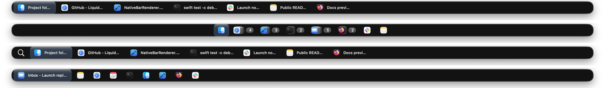

# LiquidBar




LiquidBar is a native macOS window bar for people who want a more deliberate
window switcher and taskbar-style workflow without replacing the desktop shell.
It is built with Swift, AppKit panels, retained Core Animation layers, and
system accessibility APIs.

The app is source-first right now. Build and run it locally from this repository
while release packaging, signing, and notarization are still being finalized.

## Requirements

- macOS 26 or newer
- Swift 6.2 or newer
- Accessibility permission for window management features
- Screen Recording permission for window previews

## Quick Start

```sh
swift build
swift test -c debug
swift run LiquidBar
```

Configuration is stored in `~/Library/Application Support/LiquidBar/config.json`.
Set `LIQUIDBAR_CONFIG_DIR` during development or tests to isolate config and state files.

Useful config helpers:

```sh
swift run LiquidBar -- --print-config-path
swift run LiquidBar -- --print-default-config
swift run LiquidBar -- --write-default-config
```

## Test App Bundle

Use the local test app bundle when you need a stable app identity for macOS
privacy permissions:

```sh
./scripts/build_test_app.sh
open -a "$HOME/Applications/LiquidBar Test.app"
```

## Current Capabilities

- Per-display native panels for top, bottom, left, and right bar layouts.
- Window inventory, app grouping, pinned apps, custom links, folders, spacers,
  launcher items, and user-defined tab groups.
- Hidden and minimized window handling with separate visibility and collapse
  modes.
- Optional window adjustment through Accessibility so windows do not overlap the
  bar.
- Static window previews through ScreenCaptureKit.
- Optional keyboard switcher support through global hotkeys, including the
  special Cmd-Tab event-tap path when configured.
- Retained AppKit/Core Animation rendering designed to avoid a permanent
  full-surface render loop.
- Experimental plugin/provider tiles loaded from the user config directory.
- GitHub update checks restricted to the canonical `gradigit/LiquidBar` release
  namespace.

## Source Map

- `Sources/LiquidBar/App`: application lifecycle and command-line entry points
- `Sources/LiquidBar/Config`: user configuration, custom items, tab groups, and persisted state
- `Sources/LiquidBar/EventLoop`: event coordination and UI update flow
- `Sources/LiquidBar/Renderer`: retained native layout and layer rendering
- `Sources/LiquidBar/Services`: accessibility, hotkeys, icons, plugins, thumbnails, and system helpers
- `Sources/LiquidBar/UI`: panels, native views, previews, and switcher UI
- `Sources/LiquidBar/Window`: window inventory, state, and ordering

## Documentation

- `CONTRIBUTING.md`: contribution workflow
- `SECURITY.md`: security reporting, permission boundaries, and release trust model
- `docs/START_HERE.md`: fresh-session onboarding packet
- `docs/ARCHITECTURE.md`: source map and runtime flow
- `docs/DEVELOPMENT.md`: local setup and common development commands
- `docs/TESTING.md`: SwiftPM, UI, visual regression, and release-oriented test flows
- `docs/PERFORMANCE.md`: local performance capture and A/B comparison workflow
- `docs/MAINTAINER_NOTES.md`: repository hygiene and documentation policy

## Release Trust

Official update metadata must come from
`https://github.com/gradigit/LiquidBar/releases`. Do not install release assets
from similarly named repositories or package mirrors unless they are explicitly
linked from this repository.

## License

LiquidBar is released under the MIT License. See `LICENSE`.
